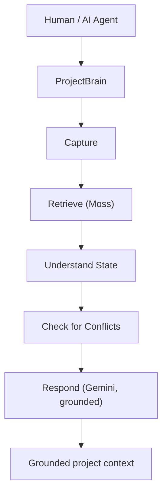
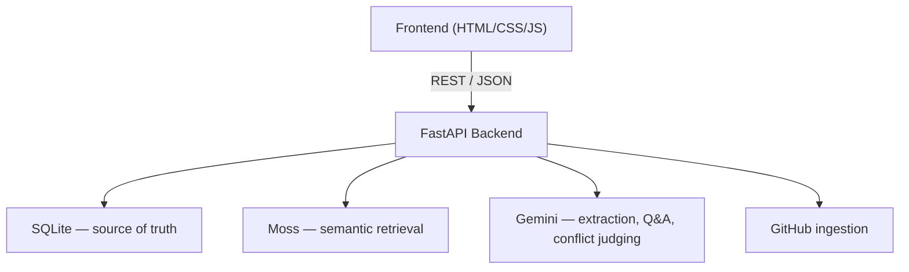
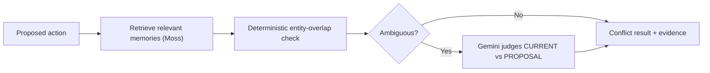

# ProjectBrain

### *The shared memory layer for humans and AI agents.*

```
┌──────────────────────────────────────────────────────────┐
│  GitHub stores your code.                                │
│  Conversations store your discussions.                  │
│  ProjectBrain stores the evolving understanding          │
│  of what the team is actually doing.                     │
└──────────────────────────────────────────────────────────┘
```

ProjectBrain is a shared, persistent project-context layer for humans and AI agents. It captures decisions, tasks, blockers, changes, and experiments in a structured store, retrieves the few relevant facts with [Moss](https://usemoss.dev), and answers questions with Gemini — grounded in citations back to the original events, not guesses.

[](https://yc-moss-projectbrain.vercel.app/)
[](https://www.python.org/)
[](https://fastapi.tiangolo.com/)
[](https://usemoss.dev)
[](https://ai.google.dev/)
[](https://vercel.com)

**🔗 Live demo:** https://yc-moss-projectbrain.vercel.app/
**📦 Repo:** https://github.com/jayvee2010/yc_moss_projectbrain

---

## The Problem

Project knowledge doesn't live in one place — it's scattered across AI chat threads, GitHub commits and issues, Slack-style conversations, one-off decisions, and half-remembered experiments. Every new AI conversation starts from zero, and every teammate returning after a few days has to reconstruct *why* something was decided by digging through old threads.

AI coding agents make this worse in a specific way: they can read your code, but they have no memory of the **reasoning** behind it. They don't know you already tried Firebase and rejected it, or that the team explicitly agreed on Postgres over Mongo last week — so they're prone to re-proposing things that were already ruled out.

## The Solution

ProjectBrain sits between your team and your tools as a **persistent, queryable record of project state** — for both humans and AI agents to read and write.



Every fact captured — a decision, a rejected approach, a blocker, a code change, an experiment result — is stored as a typed, provenanced memory: it knows *what* happened, *who* (or which AI) it came from, and *when*. Moss handles fast semantic retrieval over that memory; Gemini handles turning retrieved memories into a grounded, cited answer. ProjectBrain owns the meaning and the state — not the model.

## How It Works

| Layer | Technology | Role |
|---|---|---|
| **Frontend** | Static HTML / CSS / JS (`frontend/`) | 9-view app shell — Overview, Ask, Conflict Check, Timeline, etc. Talks to the backend over REST/JSON. |
| **Backend** | FastAPI (`backend/main.py`) | Serves the API and the static frontend; orchestrates ingestion, retrieval, and conflict checks. |
| **State store** | SQLite (`backend/database.py`) | Source of truth for every memory (decision, task, blocker, change, experiment, fact), with author and type on every row. |
| **Semantic retrieval** | Moss (`backend/moss_service.py`) | Per-project index; retrieves the top-K relevant memories for a query in single-digit-to-tens of milliseconds. |
| **Reasoning** | Gemini (`backend/llm.py`) | Extracts typed memories from raw pasted text, answers "Ask Project" questions grounded in retrieved memories, and judges ambiguous conflicts. Falls back across a model chain on errors. |
| **GitHub ingestion** | `backend/github_ingest.py` | Pulls commits, issues, and README content from any public repo and turns them into memories. |

### Architecture



This is the actual implemented system — no multi-agent orchestration, no agent-to-agent handoff, no vector database beyond Moss's own index.

## Core Features

| Feature | What it does |
|---|---|
| 🧠 **Project Memory** | Typed, provenanced memories (decision, task, blocker, change, experiment, fact) stored in SQLite with author + timestamp on every entry. |
| 🔍 **Semantic Retrieval** | Moss returns the top-K relevant memories for any query, per-project, with measured retrieval latency shown in the UI. |
| 💬 **Grounded Q&A** | "Ask Project" answers questions using only retrieved memories, with source cards (memory id, author, timestamp, relevance) — never a hallucinated answer. |
| ⚠️ **Conflict Detection** | Proposing something that contradicts an existing decision gets flagged before it becomes a repeated mistake. |
| 📊 **Project State** | Derived, clearly-labeled health meters, open task and blocker counts, and per-view state summaries. |
| 🕒 **Timeline / Activity** | A "living thread" view of everything that's happened, with day separators and per-type nodes; a live activity ticker. |
| 🔗 **GitHub Ingestion** | Connect any public repo — recent commits become `change` memories (with real git authors), open issues become `task`/`blocker` memories, and the README feeds an AI insight pass. |

### Conflict Detection Flow



A direct entity overlap (e.g. proposing MongoDB against a recorded PostgreSQL decision) is caught deterministically and returns `DIRECT_CONFLICT`, citing the original decision memory. Less clear-cut cases are handed to Gemini as an LLM judge, which returns a verdict alongside the evidence it used.

## Why Moss?

ProjectBrain's core promise — that an AI agent's answer is grounded in what actually happened, not what it assumes — only works if retrieval is fast enough to run on every question and every conflict check without becoming the bottleneck. Moss builds a per-project semantic index and answers queries via an in-process query path, so "Ask Project" and "Conflict Check" can call it on every request rather than caching or batching around it. Indexes are pre-warmed once per process at startup and synced in place (upsert + delete-stale) so reconnecting a repo never rebuilds an index from scratch.

## Tech Stack

| Category | Technology |
|---|---|
| Language | Python 3.12+ |
| API framework | FastAPI, Mangum (serverless adapter) |
| Data validation | Pydantic |
| Database | SQLite |
| Semantic retrieval | Moss |
| LLM | Google Gemini (`google-genai`) |
| HTTP client | httpx |
| Frontend | Static HTML, CSS, vanilla JavaScript |
| GitHub integration | GitHub REST API |
| Deployment | Vercel |

## Project Demo

The repo ships a seeder (`backend/seed.py`) that populates a demo project called `aura-smart-home` with a realistic decision/rejection/blocker history. The 60-second walkthrough:

1. **Overview** — project health meters, a live "LIVE NOW" activity ticker, and the recent decision feed.
2. **Ask Project** — asking *"Why did we reject Firebase?"* returns a grounded answer citing provenanced memories, with a retrieval-latency chip showing the real Moss query time (never hardcoded).
3. **Conflict Check** — proposing MongoDB against the project's recorded Supabase decision returns a `DIRECT_CONFLICT` verdict, citing the original decision and its rationale.
4. **Feed Context** — pasting a public GitHub repo URL turns its recent commits, open issues, and README into project memories within seconds.
5. **Settings** — switching projects swaps to a fully separate context, including its own Moss index.

## Performance

> Measured on the developer's local machine (warm index, September 2026) — **not** official Moss benchmarks, and not measured at production scale.

| Scenario | Measured retrieval |
|---|---|
| `aura-smart-home` index (52 docs), across 6 different questions | 4.4 – 8.7 ms |
| `webscraping` index (51 docs, real repo ingest) | 27 – 30 ms (warm) |
| Brand-new index, first-ever query (cold index creation + load) | ~2.6 s once, then warm numbers above |

The at-scale (thousands of memories) benchmark has not been run yet — see [Future Work](#future-work).

## Getting Started

**Requirements:** Python 3.12+, a Moss account (project id + key), a Gemini API key (free tier works). A GitHub token is optional — it raises ingestion rate limits from 60 to 5,000 requests/hour.

```bash
# 1. Clone
git clone https://github.com/jayvee2010/yc_moss_projectbrain.git
cd yc_moss_projectbrain

# 2. Create a virtual environment
python3 -m venv .venv
# macOS/Linux:
source .venv/bin/activate
# Windows (PowerShell):
.venv\Scripts\Activate.ps1

# 3. Install dependencies
pip install -r requirements.txt

# 4. Configure environment variables
cp .env.example .env
# then fill in .env with your own keys (see below) — never commit it

# 5. (Optional) seed demo data — the aura-smart-home story
python -m backend.seed --project-id aura-smart-home

# 6. Start the backend (also serves the frontend)
uvicorn backend.main:app --host 127.0.0.1 --port 8000
```

Then open **http://localhost:8000**. Opening `frontend/index.html` directly from disk also works, since its assets are relative and it targets `127.0.0.1:8000` automatically.

## Environment Variables

Set these in `.env` (see `.env.example`) or in your Vercel project settings. Names only — never commit real values.

| Variable | Required | Purpose |
|---|---|---|
| `MOSS_PROJECT_ID` | For retrieval | Moss project identifier |
| `MOSS_PROJECT_KEY` | For retrieval | Moss project key |
| `GEMINI_API_KEY` | For `/ask`, `/check`, AI extraction | Google Gemini API key |
| `GITHUB_TOKEN` | Optional | Raises GitHub ingestion rate limits; needed for private repos |
| `SEED_ON_BOOT` | Optional | Set to `1` to auto-seed the demo project on cold start (used on Vercel) |
| `MOSS_AUTOSYNC` | Optional | Set to `1` to let cold-start seeding also index into Moss (uses credits) |

Without `MOSS_PROJECT_ID`/`KEY` or `GEMINI_API_KEY`, the server still boots and serves everything except the AI-backed features, with graceful error states.

## API

| Method | Path | Purpose |
|---|---|---|
| `GET` | `/health` | Liveness check |
| `GET` | `/state?project_id=` | Full project state — tasks, blockers, counts, latest activity |
| `GET` | `/timeline?project_id=&type=&author=&limit=` | Filterable activity feed |
| `POST` | `/ingest` | Ingest raw text → Gemini extraction → SQLite + Moss |
| `POST` | `/ingest/github` | Connect a public repo (commits, issues, README) as memories |
| `POST` | `/ask` | Moss retrieval + grounded Gemini answer, with citations and measured latency |
| `POST` | `/check` | Conflict detection against current project state |

Example:

```bash
curl -X POST http://127.0.0.1:8000/ask \
  -H "Content-Type: application/json" \
  -d '{"project_id": "aura-smart-home", "question": "Why did we reject Firebase?"}'
```

## Project Structure

```
backend/
  main.py           FastAPI routes, static UI serving
  database.py       SQLite schema + queries (source of truth)
  moss_service.py   Moss index lifecycle: per-project indexes, pre-warm,
                     in-place sync, measured query path
  llm.py            Gemini client + extraction prompt + model fallback chain
  github_ingest.py  GitHub API connector
  seed.py           Demo data seeder
frontend/
  index.html        App shell (9 views)
  styles.css        Design system
  app.js            Views, router, keyboard shortcuts, offline states
requirements.txt
vercel.json
.env.example
```

## Design Philosophy

- **Persistent project context** — state outlives any single chat session.
- **Retrieval before reasoning** — the model only answers from what was actually retrieved.
- **Evidence-backed answers** — every answer and every conflict verdict cites the memories behind it.
- **Structured project state** — decisions, tasks, blockers, changes, and experiments are typed, not free text.
- **Lightweight architecture** — SQLite as the source of truth, Moss for retrieval, no unnecessary infrastructure.

## Challenges

- **Serverless + native wheels don't mix cleanly.** The Moss SDK ships native wheels, and the 0.25.x series has no `manylinux_2_34` wheel — the format Vercel's build image needs. On Vercel, Moss is skipped via an environment marker in `requirements.txt`, and the app falls back to SQLite-only mode: browsing, ingestion, and conflict *recording* still work, but `/ask` and `/check` return a clear "Moss SDK not available on this platform" error until a compatible wheel ships. Full retrieval (the 4.4–8.7 ms numbers above) currently runs locally on macOS.
- **Avoiding hardcoded credibility.** The retrieval-latency numbers shown in the UI are the actual measured Moss round-trip from `query_memories()`, not a fixed display value — worth the extra plumbing to get right for a hackathon demo that judges will scrutinize.
- **Graceful degradation without API keys.** The backend needed to boot and serve a usable app even with no `.env` configured, rather than crashing on missing credentials.

## What We Learned

- Grounded, cited answers are only as good as the retrieval feeding them — investing in Moss's index lifecycle (pre-warming, in-place sync) mattered more than tuning the LLM prompt.
- Serverless environments impose real constraints on native dependencies; designing for graceful degradation (SQLite-only fallback) turned out to be as important as the "happy path" demo.
- Separating **state** (SQLite, deterministic) from **retrieval** (Moss) from **reasoning** (Gemini) made the conflict-detection flow much easier to reason about and debug than a single end-to-end LLM pipeline would have been.

## Future Work

> Everything below is **not yet implemented** — listed as direction, not current functionality.

- Benchmarking retrieval and conflict detection at a 10,000+ event scale.
- Automated test coverage for the ingestion, retrieval, and conflict pipelines.
- A compatible Moss wheel for Linux/serverless so `/ask` and `/check` work on Vercel without a local fallback.
- Persistent storage for serverless deployments (currently `PROJECTBRAIN_DB_PATH` needs to point at a hosted DB for data to survive past the instance lifetime).

## Honest Status

Built for a hackathon. The core loop — ingest → index → retrieve → grounded, cited answer → conflict flag → resolve (supersede/keep) — is verified end-to-end with real credentials. Not done: the at-scale benchmark and automated tests (see Future Work). This is not a production-ready system, and retrieval performance figures above are local development measurements, not vendor benchmarks.

### Deployment Note (Vercel / Serverless)

The app deploys to Vercel (`vercel.json` included). Set `SEED_ON_BOOT=1` to seed the demo project into `/tmp` on cold start. Because of the Moss native-wheel limitation described above, the hosted demo runs SQLite-only for retrieval-dependent endpoints; browsing, ingestion, and conflict recording work as normal. Data written on a serverless instance lives only for that instance's lifetime unless `PROJECTBRAIN_DB_PATH` points at a hosted database.
